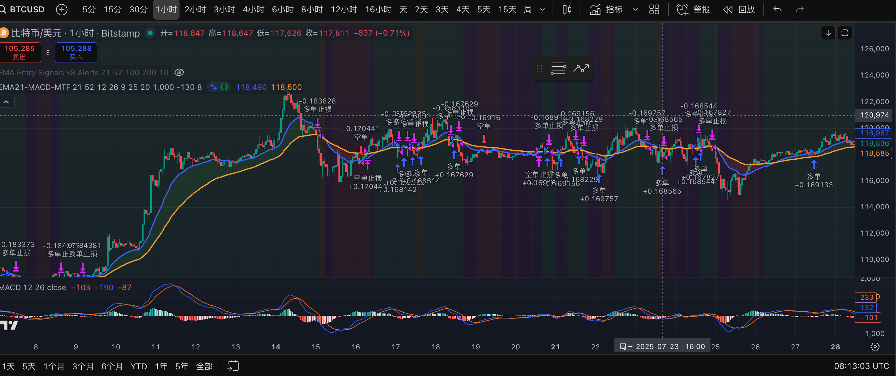

# MACD
EMA 21 均线系统
只做btc, 主要应用于 btc 1小时 和 4小时级别

btc 1小时参数调节: 
1.  4小时MACD 阈值 1000
2.  下跌线段DEA 确认k线数 8根 (8根后正式为从上涨线段变成下跌线段)
3. 零轴下突破的 DEA 阈值: -80 (慢线接近0轴,有突破的可能)
4. 突破k线数: 8 (如果在8根k线内突破,则视为强有力的反转, 否则开启零轴下的反抽)

进场条件:
main: 从ema 52 穿过 ema 21，52在21之下，macd线呈上升趋势进场
止损：跌破ema52并且在ema52-300点
止盈：

1. 主动止盈:超破前高出百分之50仓位
2. 被动止盈: 跳空后跌破开盘价 or 后续再跌破ema52并且在ema52+100点止损


```
注释
// (如果4h 慢线大于0 and 4小时的白线减去当前柱高度<800)  or   小于0且柱子为绿色,
// 如果4h 慢线 < 0 且 白线-当前柱高大于1000  and  柱子大于 -30 并且 黄白线差值 小于200
// 遇到正向阴阳冕做空，遇到反向做多
//止损:阴阳冕最后一根绿柱对应的k线的高点正向+50点，反向-50点
// 止盈：阴阳冕当前时间周期的ema52正向+20点，反向-20点
```


### 2025-10-14

1. 分批平仓功能 (MACD.pine:175-187)
第一次止盈：突破近期前高时，使用 qty_percent=50 平掉50%仓位
第二次止盈：跌破EMA52时，平掉剩余仓位
使用 first_tp_triggered 标志防止重复触发

2. 止损冷却机制 (MACD.pine:118-139)
检测止损：跌破EMA52且未触发第一次止盈时视为止损
止损后记录 last_stop_loss_bar
冷却期：止损后50根K线内不允许新开仓（可在参数中调整）
入场条件新增 cooldown_filter 检查

3. 零轴下突破场景 (MACD.pine:90-111)
触发条件：
DEA在零轴下方（dea < 0）
DEA高于阈值（默认 -60）


### 2025-10-15 逻辑
1. 止损冷却机制(去掉冷却k线反而会有更多的做单机会)
2. 止损逻辑变成: k线跌破ema52之后下一根的收盘价小于ema52 
3. 加入只在下跌线段中 k线突破大于ema21,再次跌破ema21的时候做空,止损突破ema52止损
4. 一共在分类成4类线段, 更新颜色上涨线后跌破后为浅橙过度,  下跌线段 足dea小于80,在8根突破的过程中为浅紫色标记

- 只在紫色的即将突破线段和绿色的上涨线段做多单
- 只在红色的下跌线段做空单


### 2025-10-16 逻辑

1. 修改上涨线段变盘的判断逻辑：用EMA21和EMA52关系替代固定K线数
2. 允许橙色过渡(上涨线段变盘区域)区域做多单


# 复盘逻辑: 

## 高盈亏比场景:

ema21 52 趋势排列后, 第一次回踩

2025-05-30


2025-07-09


## 需要人工过滤的零轴粘合场景:

2025-05-14


2025-07-15 到 2025-07-25




## 第二次止盈逻辑介绍:

2025-08-07


